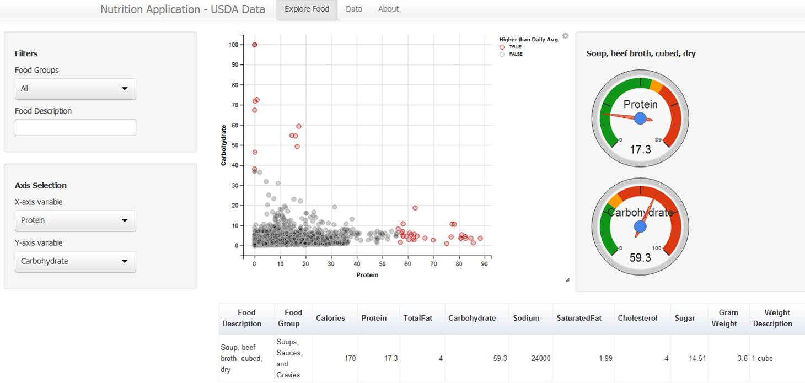

## Mission


We experiencing epidemic rates of overweight and obesity, the online resources and tools can empower people to make healthier food choices for themselves, their families, and their children. This application attempts to help identify unhealthy food easily so that we can make better food choices. The data for this application is sourced from USDA National Nutrient Database <http://www.ars.usda.gov/Services/docs.htm?docid=8964>

--- .class #id 

## Features

Find nutrient information on over 8,000 foods easily using Nutrition Facts.All data are based on the latest USDA data, SR26. It includes more than 15 nutrition values for most food items. Standard measures (ounces, cups, spoons, etc) for each food makes it easy to understand. Detailed classifications of food items for an even more accurate search.

1. Search our database of over 8000 foods by food name or food group. All indexed food is directly from the USDA.
2. Dairy & Egg, Spices & Herbs, Baby Foods, Fats & Oils, etc. Explore Food has a full selection of Food Categories allowing for easy search
3. User interface was designed with the user in mind. Intuitive side menu, appealing style and color, and a HUGE food database all have your satisfaction in mind.
4. Scatter Plot by nutrients function in Explore Food is a great way to pick out the right food for you. Simply select the nutrients in x and y axis and click any point on the plot, and find all the food that is high, or low, in your desired nutrient.
5. You can use the Data tab to easily review all the data in our database and search based on any column.


--- .class #id 


## Explore Food Items

</img> 

--- &twocol w1:50% w2:50% 


## About Data

```{r echo=F}
df <- readRDS("USDA.rds")
```
Number for food items included in the data are `r nrow(df)`.
Following are counts by food groups.

*** =left
```{r echo=F,results = 'asis'}
suppressPackageStartupMessages(require(plyr))
list <- ddply(df,"fdGrp.Desc", function(x) c(count=nrow(x)))
knitr::kable(list[1:13,])
```

*** =right
```{r echo=F,results = 'asis'}
knitr::kable(list[14:25,])
```


